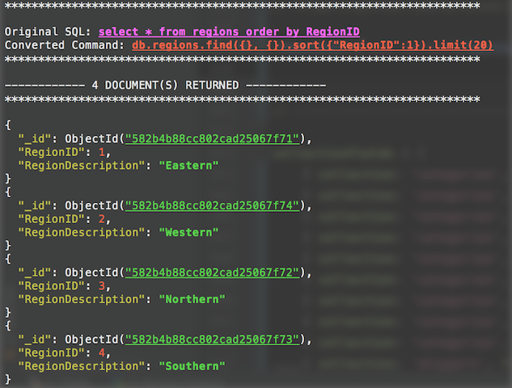
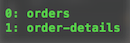
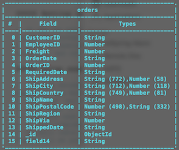

# sqlToMongo

#### Personal project to query using standard SQL in Mongo shell and have it converted to MongoDB queries, with custom tab completion (WIP).

   
### Querying   
--------------------------

Queries can be constructed like so: `db.sql('select * from collection')`.  

When the results are returned, the original SQL, along with the converted MongoDB query, are displayed for convenience. 

By default, query results are prettified, but you can have the uglified results returned by entering 1 after the SQL query (e.g. `db.sql('select * from collection', 1)`.

Notes / Tidbits:

- When adding filters to your SQL query, you do not need to wrap string values in quotes.
- In order to protect against long-running queries, a default limit of 20 records is set. To override this, simply add `top N` to your query (see below). 

Currently queries only support:
- Basic filtering (`=`, `<`, `>`, `<=`, `>=`), `and`, `or`, `in`, `like`, ...
- Not equal to (use `!=` operator ...`db.sql('select * from collection where field != value)`)
- Not in (use `!in` operator and simply separate values by a comma, with no parentheses).  E.g. `db.sql('select * from collection where field !in value,value)`) 
- Top N `db.sql('select top 20 * from collection)`
- Order by (delimit conditions by comma)  `db.sql('select * from collection order by field1 asc, field2 desc)`
    
### Custom Autocompletion
----------------------------

As an example, the sample Northwind database (credit to tmcnab https://github.com/tmcnab/northwind-mongo) was used to illustrate the autocompletion. 

##### Setting up example database:
             
1. To see the autocompletion in action, start the Mongo server (`mongod`), and run `mongo` in another terminal window
2. Clone or download the `northwind-mongo` project from the link above, cd into the directory, and run the `mongo-import.sh` file from the terminal

##### Using example auto-completion

1. Once the database has been imported, type `nw` and press tab.  You should see it expand to `use Northwind`
2. Now, type `sel`and press tab.  You should see that expand to `db.select * from `
3. Next, type `o` and tab.  You should see a list of all the collections that begin with `o` (in this case **order-details** and **orders**).

4. To auto-complete the collection name, enter the number listed and press tab again.
5. An ascii table (credit to https://github.com/sorensen/ascii-table) of the collection fields will be printed out to remind you what fields are available.

	- This table can also be generated by calling .fields() on a given collection (` db.orders.fields()`)
	  
##### Auto-completion field names
1. Type `w` and you will see it expand to `where`.  
2. Type space followed by the first letter of one of the field names, like `d` (casing doesn't matter).
3. All of the fields that begin with `d` will be listed, which can be selected by entering the number listed next to the field and pressing tab. 
4. Finally, complete the query and remember to add the closing quote and parenthesis (which can also be auto-completed by tabbing after space).

##### Replacing example collection info
  
 At the very bottom of .mongorc.js, you'll find the `collectionFields` array, containing objects with the list of fields / types for each collection.    
* This object was generated by running the variety.js schema analyzer (https://github.com/variety/variety)
	- getSchema.js iterates over each of the Northwind collections to generate all of the output at once. To run this file, type `node getSchema.js` in this project directory.
	- It's probably easiest to convert the ascii output from variety.js to the necessary array of objects, and paste it into .mongorc.js.

##### Replacing / Adding custom auto-completions

See `snippetMap` global variable on line 14.

##### Result Coloring

Credit to tylerbrock / mongo hacker http://tylerbrock.github.com/mongo-hacker for result coloring (which is awesome).